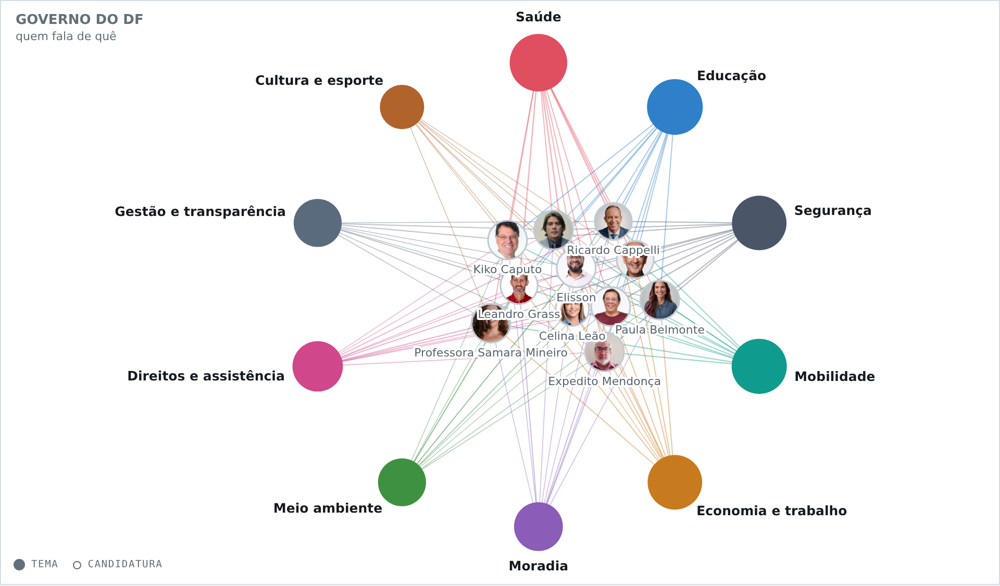
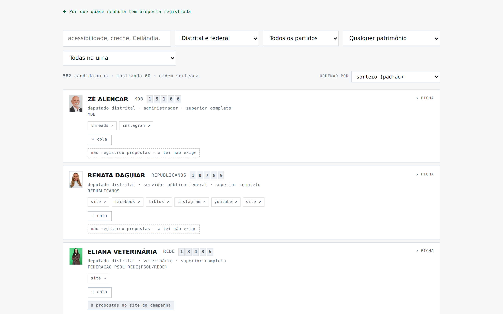
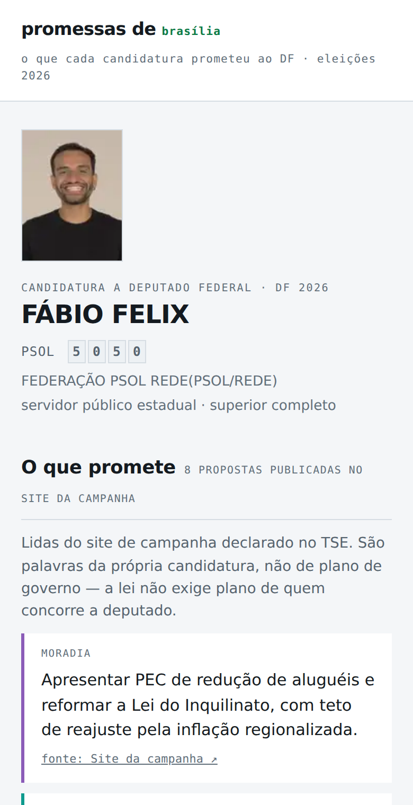

# promessas de Brasília

**O que cada candidatura prometeu ao Distrito Federal nas eleições de 2026, com a fonte de cada promessa.**

### → **[brunoduarte40.github.io/promessasdebrasilia](https://brunoduarte40.github.io/promessasdebrasilia/)**


| | |
|---:|---|
| **626** | candidaturas: governo, senado, deputado distrital e federal |
| **552** | promessas publicadas, **todas com link da fonte** |
| **0** | inferidas, deduzidas ou ponderadas por baixo do pano |
| **0** | financiamento, publicidade, patrocínio ou impulsionamento |

**Página independente.** Feita por Bruno Duarte, em Brasília, pessoa física, por conta própria. Sem vínculo com candidatura, partido, coligação ou governo.

---

## O que ela faz

**Teste de afinidade às cegas.** Você escolhe até três temas, lê as propostas **sem saber de quem são** e só depois os nomes aparecem. Uma proposta por candidatura em cada tema, para que ninguém pontue mais por ter escrito mais.

**Comparador lado a lado** de até três candidaturas, tema por tema, cada proposta com o link de onde saiu.

**Mapa de temas.** Os dez temas ficam ancorados num anel e cada candidatura é puxada para aqueles em que tem proposta. Distância do centro é amplitude; a direção em que a bolinha pende é ênfase. O que ele mostra de verdade é **onde há silêncio**.



**As 582 candidaturas a deputado, uma a uma** — com ficha do TSE, patrimônio declarado, atividade no mandato para quem tem, e busca que procura dentro de proposta, bandeira e biografia, não só no nome.



**Uma página própria para cada uma das 626**, sem uma linha de JavaScript, com título e prévia de link próprios. É o que se manda num grupo de WhatsApp, e é o que o buscador enxerga.



---

## Por que o código está aberto

A plataforma inteira se sustenta numa afirmação: **não favorecemos ninguém.** Um texto na página de metodologia pede que você acredite. O código aberto deixa você conferir:

- a ordem das candidaturas é sorteada a cada visita — [`shuffle()`](docs/index.html), aplicado em todas as telas
- cada candidatura ao governo entrou com 15 a 17 propostas, independentemente do tamanho do plano ou da campanha — planos maiores foram recortados, não privilegiados
- o teste de afinidade é cego: você responde sem ver de quem é a proposta
- o site de campanha de cada candidatura entrou com no máximo 8 propostas, para que orçamento de comunicação não vire vantagem editorial
- nada é ponderado por baixo do pano

Não há nada escondido aqui: o TSE e a Câmara Legislativa publicam APIs abertas e sem autenticação, então não existe chave nenhuma nos coletores. Não há servidor, não há banco, não há dado de usuário.

## O que a página guarda sobre quem entra

Nada. Sem cadastro, sem login, sem cookie, sem medidor de audiência. Nenhuma requisição sai para terceiros. A "Minha cola" — a lista de números que a pessoa monta para levar à urna — fica no `localStorage` do próprio navegador e limpar os dados dele apaga.

## De onde vêm os dados

| Fonte | O que traz |
|---|---|
| [DivulgaCandContas / TSE](https://divulgacandcontas.tse.jus.br) | registro, situação, número na urna, partido, coligação, ocupação, escolaridade, bens declarados, retrato oficial, endereços declarados |
| [PLE / Câmara Legislativa do DF](https://ple.cl.df.gov.br) | proposições, projetos por tema e região administrativa dos deputados distritais em exercício |
| Planos de governo protocolados no TSE | as propostas das candidaturas majoritárias |
| Sites de campanha declarados no TSE | as propostas das candidaturas a deputado — a lei não exige plano de governo delas |
| Portais de imprensa do DF | manchetes, coletadas por feed |

**Nenhuma proposta foi inferida.** Nada foi deduzido do partido, da trajetória ou do que "seria coerente" com o discurso. Onde não havia fonte, o campo ficou vazio — e a página diz que ficou.

## Estrutura

```
index.html         a plataforma, como ela é editada — sem <head>, que o montador acrescenta
docs/              o site publicado (GitHub Pages serve daqui)
  index.html       a plataforma com o envelope completo
  *.js             os dados, carregados como scripts
  c/<apelido>/     uma página estática por candidatura — 626 delas
  c/index.html     o índice das 626
  c/ficha.css      a folha de estilo das fichas, uma só para todas
  sitemap.xml      o mapa que o buscador lê
  robots.txt       o ponteiro para o mapa
README.md          este arquivo
*.mjs              os coletores e os dois montadores
```

Para reconstruir o site depois de mexer no `index.html` ou nos dados:

```
node montar-site.mjs && node gerar-paginas.mjs
```

O `index.html` não tem dependência de CDN, não usa framework e roda inteiro no navegador. Primeiro acesso: ~315 KB comprimidos. Os retratos das 602 candidaturas a deputado e as proposições da Câmara só carregam quando alguém abre a aba de deputados.

## Por que cada candidatura tem uma página própria

Dentro da plataforma, cada candidatura já tinha endereço — `#candidato/sardinha-33123`. Só que esse endereço **não existe para o buscador**: ele só aparece depois que o JavaScript roda, e robô de indexação não espera. Eram 626 fichas prontas e invisíveis. Quem procurasse por um nome no Google não encontrava nada.

As páginas em `docs/c/` são arquivos de verdade, **sem uma linha de JavaScript**: o conteúdo está escrito no HTML, com título, descrição e endereço canônico próprios. É o que faz uma candidatura ser encontrável por quem digita o nome dela — e o que faz o link chegar num grupo de WhatsApp dizendo de quem é a ficha, em vez de chegar cru.

O botão *copiar o link desta página*, dentro da plataforma, entrega o endereço dessas páginas, justamente porque é o único que serve para circular.

## Coletores

Todos são Node 18+ sem dependência, exceto onde indicado. Rode da raiz do projeto.

| Script | O que faz | Quando rodar |
|---|---|---|
| `atualizar.mjs` | relê no TSE a situação de registro e os bens das 626 candidaturas e funde nos arquivos existentes, preservando tudo que foi acrescentado depois | perto da eleição — registro muda até a véspera |
| `coletar-deputados.mjs` | monta a base das candidaturas a deputado do zero | só na montagem inicial |
| `noticias.mjs` | coleta manchetes dos portais do DF | periodicamente |
| `fotos-deputados.mjs` | baixa os 602 retratos oficiais e gera o pacote em WebP (precisa de `sharp`) | uma vez |
| `gerar-fotos.mjs` | o mesmo para as 24 candidaturas majoritárias | uma vez |
| `montar-site.mjs` | monta a pasta `docs/` com o envelope HTML completo | antes de cada publicação |
| `gerar-paginas.mjs` | escreve as 626 páginas estáticas de candidatura, o índice, o `sitemap.xml` e o `robots.txt` | depois do `montar-site.mjs`, sempre |
| `criar-formulario.gs` | Apps Script que cria o formulário de correção no Google Forms | uma vez |

`atualizar.mjs` grava um `mudancas.txt` com tudo que mudou, linha a linha, e uma seção separada para o que precisa de decisão humana.

## Correções

Erro encontrado é erro para corrigir: a correção é publicada e a data de atualização muda junto.

Toda correção precisa de **fonte verificável** — é a mesma exigência que vale para cada proposta publicada. Um canal que aceita "está errado, confia" abriria pela porta dos fundos exatamente o que a metodologia fecha pela frente.

O formulário de correção está na aba **Metodologia** da página, em *Quem faz*.

## Licença

Os dados são públicos e vêm do TSE e da Câmara Legislativa do DF, cada um com suas próprias condições de uso. O código deste repositório é livre para uso, cópia e adaptação — inclusive para montar a mesma coisa em outro estado, que é o melhor destino possível para ele.
